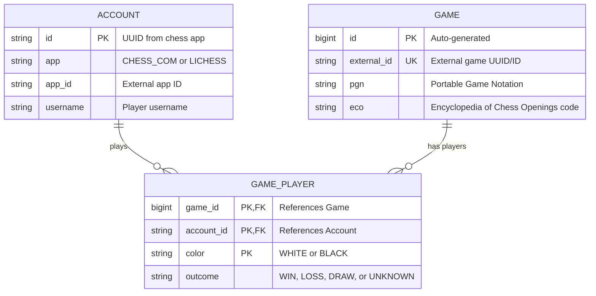

# Database Schema

This document describes the database schema for the Chesslytics application.

## Entity Relationship Diagram

## Entity Descriptions

### Account

Represents a player account from a chess platform (Chess.com or Lichess).

**Attributes:**
- `id` (String): Primary key. UUID from the chess app.
- `app` (Enum): Chess platform - `CHESS_COM` or `LICHESS`.
- `app_id` (String): External identifier from the chess app.
- `username` (String): Player's username on the platform.

**Unique Constraints:**
- Combination of `app` and `username` must be unique.

### Game

Represents a chess game with its move history and opening classification.

**Attributes:**
- `id` (Long): Primary key. Auto-generated identity.
- `external_id` (String): External game identifier from the chess platform (e.g., Chess.com UUID, Lichess ID). Unique constraint prevents duplicate ingestion.
- `pgn` (String): Complete game in Portable Game Notation format.
- `eco` (String): Encyclopedia of Chess Openings classification code (e.g., "B40").

**Relationships:**
- One game has exactly two players (one white, one black) via `GamePlayer`.

**Notes:**
- The game's source platform can be derived from the players' accounts (each Account has an `app` field).

### GamePlayer

**Weak entity** that represents a player's participation in a specific game. Only exists as part of a Game and Account relationship.

**Composite Key:**
- `game_id` (Long): Foreign key to Game.
- `account_id` (String): Foreign key to Account.
- `color` (Enum): `WHITE` or `BLACK`.

**Attributes:**
- `outcome` (Enum): Player's result - `WIN`, `LOSS`, `DRAW`, or `UNKNOWN`.

**Cascade Behavior:**
- Deleted when parent Game is deleted (orphan removal).
- Persisted automatically when Game is saved (cascade persist).

## Notes

1. **GamePlayer as Weak Entity**: GamePlayer cannot exist independently. It is always associated with both a Game and an Account, and its lifecycle is tied to the Game entity.

2. **Composite Primary Key**: The combination of `game_id`, `account_id`, and `color` uniquely identifies a GamePlayer record. This ensures each player can only appear once per color per game.

3. **Bidirectional Relationship**: Game maintains a collection of its players, while GamePlayer references both its parent Game and associated Account.

4. **Platform Flexibility**: The schema supports multiple chess platforms through the `app` field in Account, allowing ingestion from Chess.com, Lichess, or other platforms.
